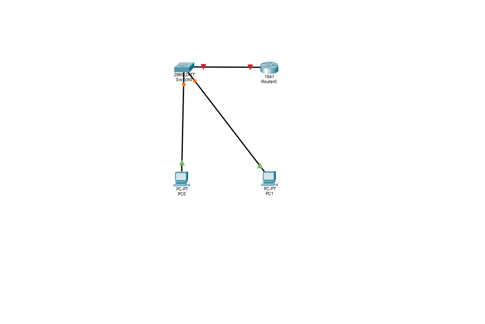
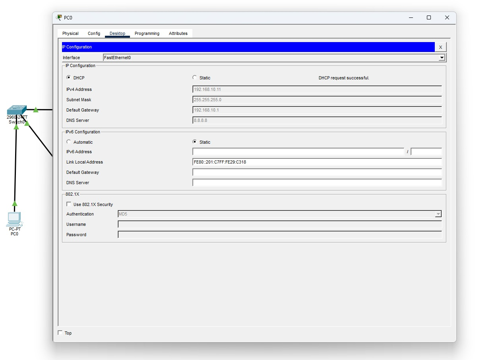
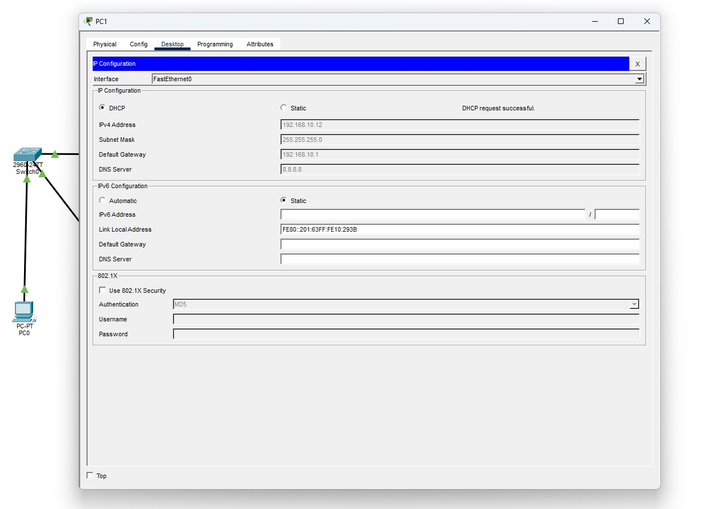

# 🌐 Proyecto de Infraestructura: Servidor DHCPv4 Centralizado en Cisco Packet Tracer

## 📋 Descripción del Proyecto
Este repositorio documenta la implementación de un entorno de red de área local (LAN) estructurada, donde se configura un **Router Cisco** para operar como un **Servidor DHCPv4 dinámico**, automatizando la entrega de parámetros de red a los hosts finales (End Devices) y evitando asignaciones estáticas propensas a errores humanos.

---

## 🏗️️ Arquitectura y Topología de Red
La red implementada consta de los siguientes componentes físicos y lógicos:

* **Dispositivo de Capa 3 (Router - Cisco 1941)**: 
  * Actúa como **Puerta de Enlace Predeterminada (Default Gateway)** para la subred `192.168.10.0/24`.
  * Funciona como **Servidor DHCP**, gestionando la concesión de direcciones IP.
* **Dispositivo de Capa 2 (Switch - Catalyst 2960)**:
  * Encaminamiento de tráfico local en la capa de enlace de datos mediante conmutación de puertos FastEthernet.
* **Hosts Finales (PCs)**:
  * Configurados en modo cliente DHCP para solicitar dinámicamente su configuración IP al conectarse al medio.

---

## ⚙️ Configuración y Comandos de Implementación
Evidencias de Funcionamiento y Verificación -> Asignación Dinámica de IP:



### 1. Activación y direccionamiento lógico de la Interfaz (Gateway)
Se configura la interfaz física del router conectada hacia el switch con la dirección IP que servirá como pasarela predeterminada de la red:
```text
enable
configure terminal
interface GigabitEthernet0/0
ip address 192.168.10.1 255.255.255.0
no shutdown
exit
```
2. Creación del Pool DHCPv4 y Exclusión de Rangos Críticos
Se excluyen las primeras 10 direcciones IP de la subred para reservarlas ante posibles dispositivos estáticos (impresoras, servidores o gateways), y se despliega el pool de direcciones dinámicas:
```text
ip dhcp excluded-address 192.168.10.1 192.168.10.10
ip dhcp pool MI_RED_LOCAL
network 192.168.10.0 255.255.255.0
default-router 192.168.10.1
dns-server 8.8.8.8
exit
```
* Pasos para tirar el comando ping:PC0.
Evidencias de Funcionamiento y Verificación -> Pruebas de Conectividad End-to-End:
```
ping 192.168.10.12
```
* Pasos para tirar el comando ping:PC1.
Evidencias de Funcionamiento y Verificación -> Pruebas de Conectividad End-to-End:
```
 ```text  ping 192.168.10.11
```


📊 Evidencias de Funcionamiento y Verificación
🔹 Asignación Dinámica de IP (DHCP Request Successful)
Los equipos cliente procesan de forma exitosa el intercambio de mensajes DHCP (Discover, Offer, Request, ACK) entregando los parámetros correspondientes de manera automática.
(Insertar aquí la captura de pantalla de la IP Configuration de la PC)

🔹 Pruebas de Conectividad End-to-End (ICMP Ping)
Se comprueba la integridad de la red mediante el envío de paquetes de eco ICMP entre los equipos de la misma subred, obteniendo un índice de pérdida del 0%.
(Insertar aquí la captura de pantalla de la consola ejecutando el comando ping con 0% loss)

🚀 Próximos Pasos (Escalabilidad del Proyecto)
Fase 2: Implementación de DHCP Relay Agent (ip helper-address) para permitir que un único servidor centralizado entregue direcciones IP a múltiples redes remotas interconectadas por varios routers.


